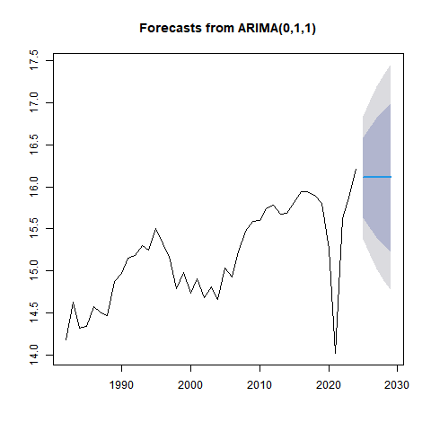

# KBO Time Series Report

2024년 시계열분석 과목 프로젝트 아카이브입니다.

KBO 리그 관중 데이터를 활용하여
시계열 분석과 ARIMA 기반 예측을 수행했습니다.

## Contents

- KBO 연도별 관중 수 분석
- ADF 정상성 검정
- ACF / PACF 분석
- ARIMA 모델링
- 향후 5년 관중 수 예측

## Structure

```text
data/      데이터 파일
scripts/   R 분석 코드
reports/   제안서 및 최종 보고서
figures/   분석 그래프 이미지
```

## Forecast Result

